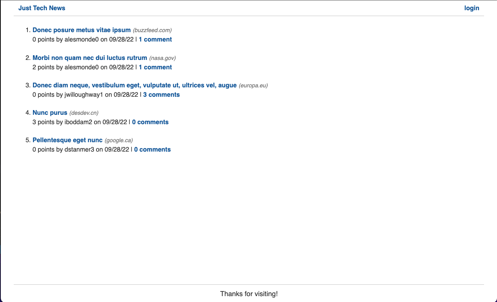
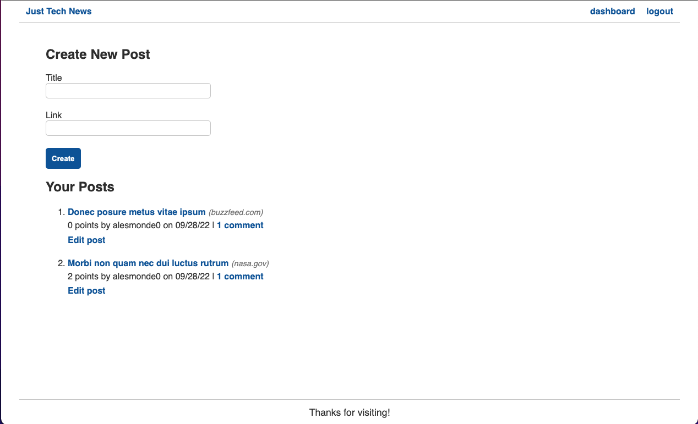
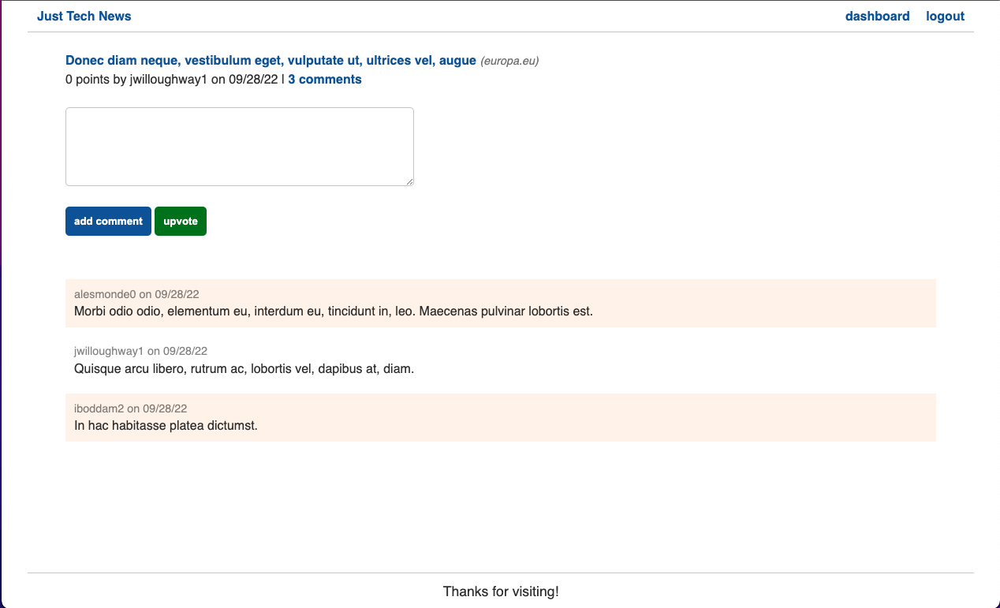

# Just Tech News
A website where users can post, upvote, and comment on links to news articles. Python was used to refactor an existing application that was originally built using Node.js.

Refactoring this app allowed me to accomplish the following:
- Set up a virtual environment for Python by using the venv module
- Defined functions and clases by using Pyhton syntax
- Created and imported Python packages and modules
- Used the Flask library to create GET, POST, PUT, and DELETE routes
- Created MySQL tables by using the SQLAlchemy ORM
- Queried a database by using SQLAlchemy methods
- Handled errors by using assert and try...except statements
- Used the contextual g and session objects of Flask across routes
- Imported cutom filter functions into Jinja templates
- Created custom decorator functions
- Saved project dependencies in a requirements.txt file.
- Configured Heroku by using Gunicorn to run Flask.

## Preview App
Homepage

User Dashboard

Post/ Comment


## [Click here to open the web app :)](https://just-tech-newzz.herokuapp.com/)

## To Run Locally
run the following commands from the root directory of python-newsfeed:

```python3 -m venv venv```

```. venv/bin/activate```

```pip install -r requirements.txt```

Next, create a .env file in the root directory of the project, and add the following line to it:

```DB_URL=mysql+pymysql://root:<password>@localhost/python_news_db```

Make sure to change ```<password>``` to the password of your root user.

```python3 seeds.py```

```python -m flask run```


